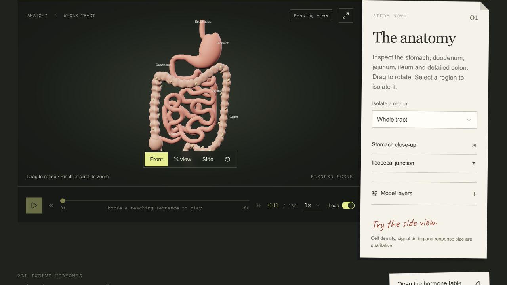

# Entero



[Open private demo](https://entero.jordanmatthew.me) · Owner sign-in required.

What happens in the gut's signaling pathways after a meal?

An interactive 3D physiology teaching prototype. Explore anatomical regions, source–target relationships and a qualitative meal-response sequence. A reading view retains explanatory content when graphics are unavailable.

## Technical decisions

- Separate exported geometry, teaching metadata and browser interaction state.
- Coordinate timeline steps, scene visibility and explanatory text.
- Handle failed model loads and graphics-context loss with a usable reading fallback.
- Dispose scene resources when changing or leaving the viewer.

## Reproduction and status

The browser uses bundled assets. Rebuilding Blender exports currently also requires original scene files and configured source paths. A public release must state that distinction and resolve asset redistribution rights.

Working private educational prototype. It does not simulate hormone concentrations or predict a patient's response. Structural scene checks and browser fault checks do not establish physiological validity or learning gains. Independent learner, physical-device and full screen-reader reviews remain open.

## Run locally

Node 22.13+ and npm. From the repository root:

```sh
npm ci
npx tsc --noEmit
npm run build
npm start -- --port 4188
```

Open http://127.0.0.1:4188/. In another terminal, `node scripts/check-startup.mjs http://127.0.0.1:4188/` checks the initial server response. Optional asset checks: `python3 scripts/validate_web.py` (220 structural checks). These commands were verified in the existing release candidate; no new performance result is implied.

See `docs/ENGINEERING_CASE_STUDY.md` for architecture and `docs/REBUILD.md` for the separate Blender workflow. Preserve the binding-only local `.openai/hosting.json`, which the build imports. The website uses bundled exports and does not need Blender installed.

This is a release draft. Original-code licensing and source-scene distribution remain pending.